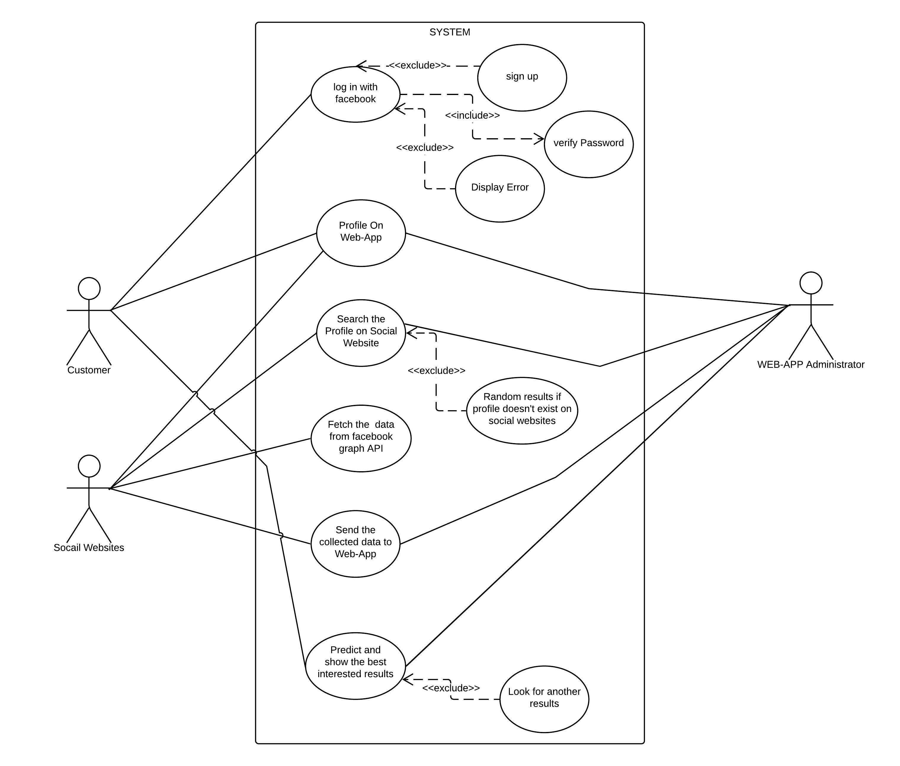
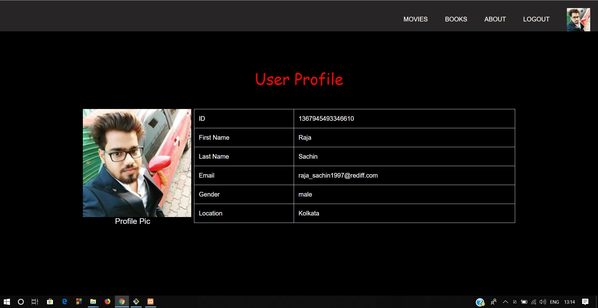
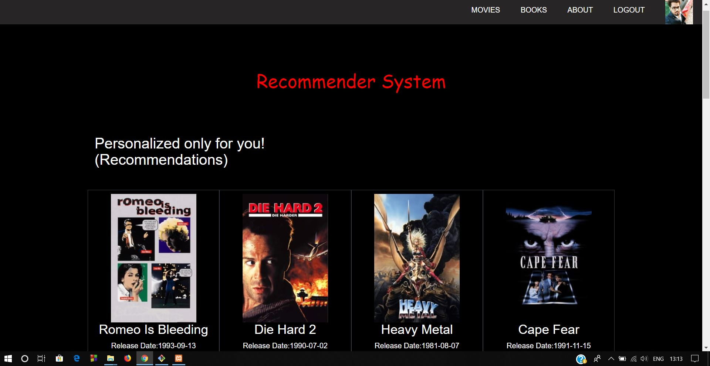
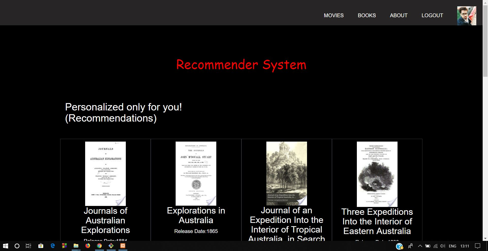

# Interest Based Recommender System

I have used Facebook Graph API which fetches the data corresponding to an user's profile as the user logins. While log in, the
premission is asked for publicly accessible data to the profile and if the premission is granted, then the access token is generated which is used in URL for the get request in python code which correspondingly fetches the data like movies, books, likes etc.

The fetched data is fed into the machine learning algorithm which predicts the closely related movies, books etc which is further used
for the recommendation.

I have also used TMBD and Google API for the details of the movies, books etc like posters/covers and other details to show on the web pages.
The movie and book pages show the recommended movies in web page. The profile is created dynamically using the facebook accessible data. The about page shows the profile image, name, gender and other details.

Steps to run the System :
1. Install Anaconda and Spyder.
2. Install the XAMPP/WAMP Server.
3. Copy the project folder (final) inside the htdocs folder of the XAMPP folder or www folder of the WAMP folder.
4. The "Final" folder must contain facebook SDK and all the PHP, Python, HTML and CSS files.
5. Start your XAMPP/WAMP server.
6. Type the url in the brower : http://localhost/final/login.php
7. Click on Log In With facebook.
8. Log In into facebook and grant the premissions.
9. Get the best recommended movies, books etc.
10. Click on logout to get logout from the web. Session will be destoryed.

The Usecase Diagram for the above System is given below:

Some of the screenshots are given below : 

About Page :

Recommended Movies Page : 

Popular Movies Page :

Recommended Books Page : 

